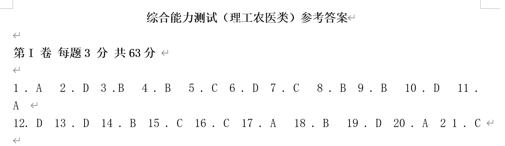
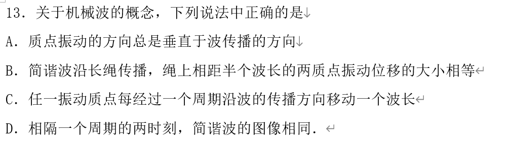
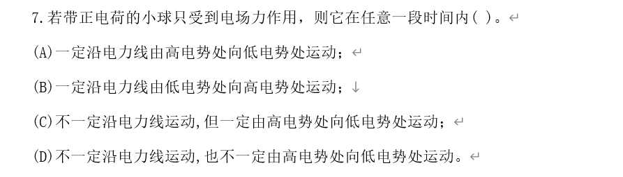

# 使用方法
使用脚本将文件夹中的.doc批量转换为.docx，第一个参数是源文件夹，第二个是目标文件夹
```bash
./doc_to_docx.sh /root/test /root/test_docx 
```
在linux中使用soffice把doc转为docx会丢失wmf形式的公式，改为在windows中使用word文档的vba自动将.doc转为.docx：
1. Alt+F11打开vba
2. 复制代码如下，进行批量处理
```vba
Sub BatchDocToDocxRecursiveWithDocxCopy()
    Dim inputFolderPath As String
    Dim outputFolderPath As String
    Dim logFilePath As String

    ' 选择包含 .doc 文件的输入文件夹
    With Application.FileDialog(msoFileDialogFolderPicker)
        .Title = "选择包含 DOC 文件的文件夹"
        If .Show = -1 Then
            inputFolderPath = .SelectedItems(1) & "\"
        Else
            Exit Sub
        End If
    End With

    ' 选择保存转换后文件的输出文件夹
    With Application.FileDialog(msoFileDialogFolderPicker)
        .Title = "选择保存 DOCX 文件的文件夹"
        If .Show = -1 Then
            outputFolderPath = .SelectedItems(1) & "\"
        Else
            Exit Sub
        End If
    End With

    ' 日志文件路径
    logFilePath = outputFolderPath & "ErrorLog.txt"

    ' 调用递归函数处理文件夹
    ProcessFolderWithDocxCopy inputFolderPath, outputFolderPath, logFilePath

    MsgBox "批量处理完成！", vbInformation
End Sub

Sub ProcessFolderWithDocxCopy(ByVal inputFolder As String, ByVal outputFolder As String, ByVal logFile As String)
    Dim fileName As String
    Dim doc As Document
    Dim fso As Object
    Dim folderItem As Object
    Dim logText As String

    ' 创建输出文件夹（如果不存在）
    If Dir(outputFolder, vbDirectory) = "" Then
        MkDir outputFolder
    End If

    ' 遍历当前文件夹中的所有文件
    fileName = Dir(inputFolder & "*.*")
    Do While fileName <> ""
        On Error Resume Next ' 开始错误捕捉
        If InStr(fileName, ".docx") > 0 Then
            ' 如果是 .docx 文件，直接复制到输出文件夹
            FileCopy inputFolder & fileName, outputFolder & fileName
            If Err.Number <> 0 Then
                ' 如果复制失败，记录到日志
                logText = "复制失败: " & inputFolder & fileName & " 错误代码: " & Err.Number & " 描述: " & Err.Description & vbCrLf
                AppendToLog logFile, logText
                Err.Clear
            End If
        ElseIf InStr(fileName, ".doc") > 0 Then
            ' 如果是 .doc 文件，打开并转换为 .docx
            Set doc = Documents.Open(inputFolder & fileName)
            If Err.Number <> 0 Then
                ' 如果打开失败，记录到日志
                logText = "打开失败: " & inputFolder & fileName & " 错误代码: " & Err.Number & " 描述: " & Err.Description & vbCrLf
                AppendToLog logFile, logText
                Err.Clear
            Else
                doc.SaveAs2 outputFolder & Replace(fileName, ".doc", ".docx"), wdFormatXMLDocument
                If Err.Number <> 0 Then
                    ' 如果保存失败，记录到日志
                    logText = "保存失败: " & inputFolder & fileName & " 错误代码: " & Err.Number & " 描述: " & Err.Description & vbCrLf
                    AppendToLog logFile, logText
                    Err.Clear
                End If
                doc.Close
            End If
        End If
        On Error GoTo 0 ' 关闭错误捕捉
        fileName = Dir
    Loop

    ' 遍历子文件夹
    Set fso = CreateObject("Scripting.FileSystemObject")
    For Each folderItem In fso.GetFolder(inputFolder).SubFolders
        ' 递归调用子文件夹
        ProcessFolderWithDocxCopy folderItem.Path & "\", outputFolder & folderItem.Name & "\", logFile
    Next
End Sub

Sub AppendToLog(ByVal logFile As String, ByVal logText As String)
    Dim logFileNumber As Integer

    ' 打开日志文件（如果不存在则创建）
    logFileNumber = FreeFile
    Open logFile For Append As #logFileNumber
    Print #logFileNumber, logText
    Close #logFileNumber
End Sub
```
下面的文档无法转换（手动另存为也不行，因此放弃）：
2001年上海高考理综真题及答案
2001年天津高考理科真题及答案
2003年河北高考理综真题及答案
2004年浙江高考理科综合真题及答案
2001年上海高考理综真题及答案
2001年天津高考理科真题及答案
2005年江苏高考物理真题及答案
2003年河北高考理综真题及答案
2004年浙江高考理科综合真题及答案
2009年浙江省高考物理（含解析版）
2010年高考福建理综物理试题(含答案)

删除名字中包含“A3”的文件夹、名字中包含“原卷”的文件，物理docx是从windows机器传来的文件夹，包含docx文档
```bash
./preprocess.sh 物理_docx 物理_docx2
```

处理名字中包含特殊字符从而影响解析的问题
```bash
./rename.sh
```

预处理word文档，删除smartTag，只保留里面的<w:r>
```bash
python remove_smartTag.py  --docx_name=2004年云南高考理科综合真题及答案
```

打开图片公式识别的话，程序运行较慢，使用下面命令关闭
```bash
 python docx_to_json.py  --docx_name=2001年陕西高考理综真题及答案 --json_name=2001年陕西高考理综真题及答案 --latex=off > log.txt
``` 

使用.sh脚本，执行一个文件从.docx到.json的转换
```bash
./run_one.sh 2004年云南高考理科综合真题及答案 off > log.txt
```

使用.sh脚本，执行一个文件夹里的所有文件从.docx到.json的转换（开启公式识别将近6小时）
```bash
./run_all.sh GAOKAO off > log.txt
```

区分理综里的物理、化学、生物题
1. 使用k_means方法：
```bash
python extract_Comprehensive_questions.py
python k_means.py
```

2. 使用关键词方法：
```bash
python extract_Comprehensive_questions.py
python key_words.py
``` 

3. 使用逻辑回归分类器——准确率:0.9611764705882353
extract_train_data将output.json去重、提取单一学科的题目用于训练
extract_Comprehensive_questions.py从理化生的output.json中提取需要做区分的题目（理综）
python ml_classifier.py logistic将分类好的题目附加到对应的学科的输出中
```bash
./preprocess.sh ./物理_docx ./物理_docx2
./run_all.sh 物理_docx2 off
mv output.json output_phy.json
./preprocess.sh ./化学_docx ./化学_docx2
./run_all.sh 化学_docx2 off
mv output.json output_che.json
./preprocess.sh ./生物_docx ./生物_docx2
./run_all.sh 生物_docx2 off
mv output.json output_bio.json
python extract_train_data.py
python extract_Comprehensive_questions.py
python ml_classifier.py logistic
```

4. 使用支持向量机——准确率：0.9705882352941176
```bash
python ml_classifier.py svm
```

5. 使用朴素贝叶斯方法——准确率：0.9705882352941176
```bash
python ml_classifier.py naive_bayes
```

6. 使用bert模型——准确率：0.9764705882352941 时间：40分钟
```bash
python bert_classifier.py
```

去除重复的条目，统计ABCD选项、answer的缺失率
```bash
python postprocess.py
```

去除包含“图”关键词的题目
```bash
python exclude_pictures.py --input_file=phy_only.json --output_file=phy_no_picture.json
```

## 一个完整的工作流程belike:
在windows中完成doc->docx的转换，传到linux
```bash
rsync -av --progress --partial -e "ssh"  /mnt/c/Tech_bench/docx root@192.168.2.65:~/tech_bench/物理_docx
```
```bash
./preprocess.sh ./物理_docx ./物理_docx2
./run_all.sh 物理_docx2 off
python postprocess.py
```

识别可以通过数字扩展的题目
```bash
python find_questions_with_number.py --train_file=labeled_questions --test_file=phy_no_picture
```

word2vec环境配置
```bash
conda create -yn word2vec python=3.10
conda activate word2vec
pip install spacy==3.5.0
pip install gensim
python -m spacy download zh_core_web_sm 
python word2vec_paraphrase.py
```
word2vec 预训练模型下载：
https://github.com/to-shimo/chinese-word2vec
https://github.com/Embedding/Chinese-Word-Vectors


bert
```bash
conda create -yn bert python=3.10
conda activate bert
pip install spacy==3.5.0
pip install torch
pip install numpy==1.26.4 
pip install transformers
pip install scikit-learn
python -m spacy download zh_core_web_sm 
pip install datasets 
pip install 'accelerate>=0.26.0'
```

# 已解决的问题
- 【ok】删除目录里的A3 word版
- 【ok】删除无答案的word文档
- 【ok】前半部分是原卷、后半部分是答案的情况，如何防止重复？
    - 序号重复则跳过
- 【ok】如何区分选择题和非选择题？
    - 删除full_text中“第Ⅱ卷”、“二、”后的所有内容——有的文档里没有这些关键词
    - 删除.json中不完整的条目？
- 【ok】处理答案形式：（2023年高考物理真题（北京自主命题）（解析版））

以及前半部分是原卷，后半部分如图的情况（2020年高考全国I卷物理试题及答案）
- 【ok】处理答案形式：

(2016年高考全国I卷物理试题及答案) (1998年广东高考物理真题及答案)
- 【ok】处理答案形式：
 
(2013高考福建卷理综物理部分(含答案))

- 【ok】处理答案形式：

以及前半部分是原卷，后半部分如图的情况
（2008年全国统一高考物理试卷（全国卷ⅰ）（含解析版））
（2015高考安徽物理试卷及答案）
- 【ok】处理答案形式：
（2008安徽高考物理试卷及答案）
- 【ok】处理答案形式：
（1995年广东高考物理真题及答案）（1995年黑龙江高考物理真题及答案）
- 【ok】处理答案形式：
（2003年黑龙江高考理综真题及答案 同 2003年新疆高考理综真题及答案）
（2002年陕西高考理科综合真题及答案 同 2002年西藏高考理科综合真题及答案）

- 【ok】如何在理综试卷中区分物理、化学、生物？
    - 人工区分？工作量大
    - 使用关键词区分？
    - 在线大语言模型？尝试了gpt-4o、kimi、deepseek，准确性好，但是无法批量处理，只能返回一小部分结果
    - 本地部署开源大语言模型？
    - 聚类？k-means分类完全不准确
    - 支持向量机、逻辑回归、朴素贝叶斯？https://blog.csdn.net/haha0332/article/details/112575122
    - bert模型

# 待解决的问题
## 答案解析问题
（2008年高考贵州理综物理试题(含答案)）
（2000年湖南高考物理真题及答案）
（2019年全国统一高考物理试卷（新课标ⅰ）（含解析版））（2019年全国统一高考物理试卷（新课标ⅱ））
（2009年高考贵州理综物理试题(含答案)）

（2016年浙江省高考物理【10月】（含解析版））这里和现有逻辑不匹配是因为现有的re.match从开头开始匹配
（2011年浙江省高考物理（含解析版））
（2017年浙江省高考物理【4月】（含解析版））
（2014年上海市高中毕业统一学业考试物理试卷（word解析版））
（2006年四川高考理综真题及答案）（2007年宁夏高考理科综合真题及答案）——两种答案形式
（2017年浙江省高考物理【11月】（含解析版）——图片形式的答案
（2018年浙江省高考物理【11月】（含解析版））（2016年浙江省高考物理【4月】）
（2010年浙江省高考物理（含解析版））（2008年浙江省高考物理（含解析版）
（2017年上海市高中毕业统一学业考试物理试卷（答案版））（2003年江苏高考物理真题及答案）
（2013年上海市高中毕业统一学业考试物理试卷（word解析版））
（2015年上海市高中毕业统一学业考试物理试卷（答案版））
（2015年浙江省高考物理【6月】（含解析版））
（2012广东高考物理试卷(及答案)）
（2012年上海市高中毕业统一学业考试物理试卷（word解析版））（2013广东高考物理试卷(及答案)）
（2015年浙江省高考物理【10月】）
（2015高考福建卷理综物理部分(含答案)）
（2013年高考四川理综物理）
（2020年上海市高中毕业统一学业考试物理试卷（word解析版））
（2007年上海高考理科综合能力测试真题及答案）

- 没有冒号的“故选”——是否需要处理，加上之后可能影响其他答案识别？
 （2012高考福建卷理综物理部分(含答案)）
 （2011年高考贵州理综物理试卷(含答案)）
 （2011广东高考物理试卷(及答案)）
前一半检查完了/4673

## 选项解析问题
-  例如：“2015高考安徽物理试卷及答案” 解析内容为空
    - 原因是A、B、C、D是表格中的单元格，但是其他文档都不是这样的，放弃处理此文档
检查到613/3180

## 题目解析问题
- 题目中的公式如何识别？
    - wmf形式
    - png形式 （1999年山西高考物理真题及答案）（2018年全国统一高考物理试卷（新课标ⅲ）（含解析版））
- 题目中的表格如何识别？

## word文档中换行符不是段落结束符，影响解析
 （1994年新疆高考物理真题及答案）
Alt+F11，插入-模块-粘贴下面的内容-保存-关闭
```vba
Sub ReplaceSoftBreaksWithParagraphs()
    ' 启动查找和替换功能
    With Selection.Find
        .ClearFormatting
        .Replacement.ClearFormatting
        ' 查找软换行符（向下箭头）
        .Text = "^l"
        ' 替换为段落标记（硬换行符）
        .Replacement.Text = "^p"
        .Forward = True
        .Wrap = wdFindContinue
        .Format = False
        .MatchCase = False
        .MatchWholeWord = False
        .MatchWildcards = False
        .MatchSoundsLike = False
        .MatchAllWordForms = False
        ' 执行替换操作
        .Execute Replace:=wdReplaceAll
    End With
End Sub
```
在要转换的文档中按Alt+F8，运行ReplaceSoftBreaksWithParagraphs

## 如何处理有图的情况
-图片无法使用脚本提取，因为是根据位置决定和哪一道题绑定在一起，可能会被绑定到相邻的题目里
-rId和image的对应关系在\word\_rels\document.xml.rels中
1. 题目、图片、选项在三个连续的<w:p>里（2002年陕西高考理科综合真题及答案第3题）

2. 前半部分题目、图片、后半部分题目在三个连续的<w:p>里（2002年陕西高考理科综合真题及答案第14题）

3. 17题的图混在16题里，16题题目是一个段落，17题的图和16提的选项是一个段落
   18题的图混在17题里，17题题目是一个段落，18题的图和17题的选项是一个段落
   19题没有出现“图”关键词，但有图
   20题的图和19题的C在一个段落

## 动态生成问题
可以考虑动态生成的题目：
数字的替换
```bash
    {
        "question": "4.若元素A的半衰期为4天，元素B的半衰期为5天，则相同质量的A和B，经过20天后，剩下的质量　之比m_A:m_B=(　　　)\n　",
        "A": "30:31",
        "B": "31:30",
        "C": "1:2",
        "D": "2:1",
        "index": "4",
        "answer": "C",
        "exam": "1993年重庆高考物理"
    },
    {
        "question": "2．（6分）为了探测引力波，“天琴计划” 预计发射地球卫星P，其轨道半径约为地球半径的16倍；另一地球卫星Q的轨道半径约为地球半径的4倍。P与Q的周期之比约为（　　）\n",
        "A": "2：1",
        "B": "4：1",
        "C": "8：1",
        "D": "16：1",
        "index": "2",
        "answer": "C",
        "exam": "2018年全国统一高考物理试卷（新课标ⅲ）"
    },
```
温度标志着物体内大量[可选]的剧烈程度
```bash
    {
        "question": "3．（6分）下列说法正确的是（　　）\n",
        "A": "温度标志着物体内大量分子热运动的剧烈程度",
        "B": "内能是物体中所有分子热运动所具有的动能的总和",
        "C": "气体压强仅与气体分子的平均动能有关",
        "D": "气体膨胀对外做功且温度降低，分子的平均动能可能不变",
        "index": "3",
        "answer": "A",
        "exam": "2019年北京市高考物理试卷"
    },
```
前面的描述语言可以换成最新的新闻
```bash
    {
        "question": "6．（6分）2019年5月17日，我国成功发射第45颗北斗导航卫星，该卫星属于地球静止轨道卫星（同步卫星）。该卫星（　　）\n",
        "A": "入轨后可以位于北京正上方",
        "B": "入轨后的速度大于第一宇宙速度",
        "C": "发射速度大于第二宇宙速度",
        "D": "若发射到近地圆轨道所需能量较少",
        "index": "6",
        "answer": "D",
        "exam": "2019年北京市高考物理试卷"
    },
```
近义词替换：
- word2vec
- bert
- 是否需要一个同义词列表？？
- 只选择top1吗？

# 无法解决的问题：
1. Simpletex无法正确识别λ，尝试裁剪图片只保留公式部分，但并没有用

会被识别为

2. 题号和A.不是文本，而是自动生成的
（2023年高考物理真题（北京自主命题）（解析版））（2015广东高考物理试卷(及答案)）
3. 文件叫解析版实际没有答案（2021年天津市高考物理试卷解析版）（2005年广西高考理科综合真题及答案）
4. 试卷和答案题号不对应（2019年高考全国I卷物理试题及答案）
5. 使用这个下箭头的换行不会被解析为两个段落
