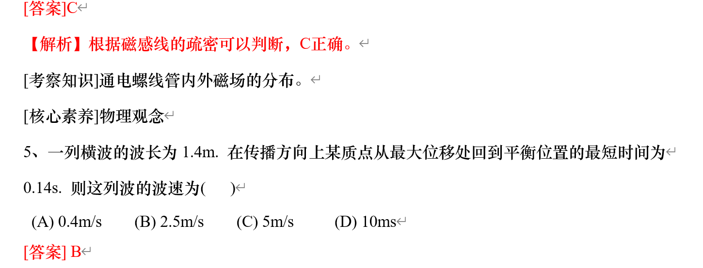

# 使用方法
使用脚本将文件夹中的.doc批量转换为.docx，第一个参数是源文件夹，第二个是目标文件夹
```bash
./doc_to_docx.sh /root/test /root/test_docx 
```

删除名字中包含“A3”的文件夹、名字中包含“原卷”的文件、并把doc转为docx
```bash
./preprocess.sh gaokao/高考物理真题/1.物理高考真题试卷 ./物理_docx
```

处理名字中包含特殊字符从而影响解析的问题
```bash
./rename.sh
```

预处理word文档，删除smartTag，只保留里面的<w:r>
```bash
python remove_smartTag.py  --docx_name=2004年云南高考理科综合真题及答案
```

打开图片公式识别的话，程序运行较慢，使用下面命令关闭
```bash
 python docx_to_json.py  --docx_name=2001年陕西高考理综真题及答案 --json_name=2001年陕西高考理综真题及答案 --latex=off > log.txt
``` 

使用.sh脚本，执行一个文件从.doc到.json的转换
```bash
./run_one.sh 2004年云南高考理科综合真题及答案 off > log.txt
```

使用.sh脚本，执行一个文件夹里的所有文件从.doc到.json的转换
```bash
./run_all.sh GAOKAO off > log.txt
```

去除重复的条目，统计ABCD选项、answer的缺失率
```bash
python postprocess.py
```

## 一个完整的工作流程belike:
把gaokao文件夹移入tech_bench
```bash
./preprocess.sh gaokao/高考物理真题/1.物理高考真题试卷 ./物理_docx
cp -r 物理_docx 物理_docx2
./run_all.sh 物理_docx2 off
python postprocess.py
```

# 已解决的问题
- 【ok】删除目录里的A3 word版
- 【ok】删除无答案的word文档
- 【ok】前半部分是原卷、后半部分是答案的情况，如何防止重复？
    - 序号重复则跳过
- 【ok】如何区分选择题和非选择题？
    - 删除full_text中“第Ⅱ卷”、“二、”后的所有内容——有的文档里没有这些关键词
    - 删除.json中不完整的条目？
- 【ok】处理答案形式：（2023年高考物理真题（北京自主命题）（解析版））

以及前半部分是原卷，后半部分如图的情况（2020年高考全国I卷物理试题及答案）
- 【ok】处理答案形式：

(2016年高考全国I卷物理试题及答案) (1998年广东高考物理真题及答案)
- 【ok】处理答案形式：
 
(2013高考福建卷理综物理部分(含答案))

- 【ok】处理答案形式：

以及前半部分是原卷，后半部分如图的情况
（2008年全国统一高考物理试卷（全国卷ⅰ）（含解析版））
（2015高考安徽物理试卷及答案）
- 【ok】处理答案形式：
（2008安徽高考物理试卷及答案）
- 【ok】处理答案形式：
（1995年广东高考物理真题及答案）（1995年黑龙江高考物理真题及答案）
- 【ok】处理答案形式：
（2003年黑龙江高考理综真题及答案 同 2003年新疆高考理综真题及答案）
（2002年陕西高考理科综合真题及答案 同 2002年西藏高考理科综合真题及答案）

# 待解决的问题
## 答案解析问题
（2008年高考贵州理综物理试题(含答案)）
（2000年湖南高考物理真题及答案）
（2019年全国统一高考物理试卷（新课标ⅰ）（含解析版））（2019年全国统一高考物理试卷（新课标ⅱ））
（2009年高考贵州理综物理试题(含答案)）

（2016年浙江省高考物理【10月】（含解析版））这里和现有逻辑不匹配是因为现有的re.match从开头开始匹配
（2011年浙江省高考物理（含解析版））
（2017年浙江省高考物理【4月】（含解析版））
（2014年上海市高中毕业统一学业考试物理试卷（word解析版））
（2006年四川高考理综真题及答案）——两种答案形式
（2017年浙江省高考物理【11月】（含解析版）——图片形式的答案
（2018年浙江省高考物理【11月】（含解析版））（2016年浙江省高考物理【4月】）
（2010年浙江省高考物理（含解析版））（2008年浙江省高考物理（含解析版）
（2017年上海市高中毕业统一学业考试物理试卷（答案版））（2003年江苏高考物理真题及答案）
（2013年上海市高中毕业统一学业考试物理试卷（word解析版））
（2015年上海市高中毕业统一学业考试物理试卷（答案版））
（2015年浙江省高考物理【6月】（含解析版））
（2012广东高考物理试卷(及答案)）
（2012年上海市高中毕业统一学业考试物理试卷（word解析版））（2013广东高考物理试卷(及答案)）
（2015年浙江省高考物理【10月】）
（2015高考福建卷理综物理部分(含答案)）
（2013年高考四川理综物理）
（2020年上海市高中毕业统一学业考试物理试卷（word解析版））
- 没有冒号的“故选”——是否需要处理，加上之后可能影响其他答案识别？
 （2012高考福建卷理综物理部分(含答案)）
 （2011年高考贵州理综物理试卷(含答案)）
 （2011广东高考物理试卷(及答案)）

## 选项解析问题
-  例如：“2015高考安徽物理试卷及答案” 解析内容为空
    - 原因是A、B、C、D是表格中的单元格，但是其他文档都不是这样的，放弃处理此文档

## 如何在理综试卷中区分物理、化学、生物？
    - 人工区分？因为理综题中三科的题目数量和顺序不固定
    - AI区分
    - 聚类？k-means


## 如何处理有图的情况
-图片无法使用脚本提取，因为是根据位置决定和哪一道题绑定在一起，可能会被绑定到相邻的题目里
-rId和image的对应关系在\word\_rels\document.xml.rels中
1. 题目、图片、选项在三个连续的<w:p>里（2002年陕西高考理科综合真题及答案第3题）

2. 前半部分题目、图片、后半部分题目在三个连续的<w:p>里（2002年陕西高考理科综合真题及答案第14题）


# 无法解决的问题：
1. Simpletex无法正确识别λ，尝试裁剪图片只保留公式部分，但并没有用

会被识别为

2. 题号和A.不是文本，而是自动生成的
（2023年高考物理真题（北京自主命题）（解析版））（2015广东高考物理试卷(及答案)）
3. 文件叫解析版实际没有答案（2021年天津市高考物理试卷解析版）
4. 试卷和答案题号不对应（2019年高考全国I卷物理试题及答案）