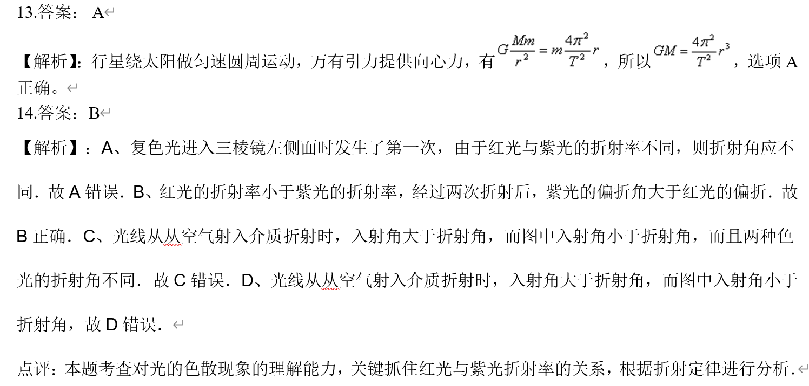

使用脚本将文件夹中的.doc批量转换为.docx，第一个参数是源文件夹，第二个是目标文件夹
```bash
./doc_to_docx.sh /root/test /root/test_docx 
```

预处理word文档，删除smartTag，只保留里面的<w:r>
```bash
python remove_smartTag.py  --docx_name=2004年云南高考理科综合真题及答案
```

打开图片公式识别的话，程序运行较慢，使用下面命令关闭
```bash
 python docx_to_json.py  --docx_name=2001年陕西高考理综真题及答案 --json_name=2001年陕西高考理综真题及答案 --latex=off > log.txt
``` 

使用.sh脚本，执行一个文件从.doc到.json的转换
```bash
./run_one.sh 2004年云南高考理科综合真题及答案 off > log.txt
```

使用.sh脚本，执行一个文件夹里的所有文件从.doc到.json的转换
```bash
./run_all.sh GAOKAO off > log.txt
```

待解决的问题：
- 【ok】删除目录里的A3 word版
- 【ok】删除原卷和无答案的word文档
- 【ok】处理答案形式：（2023年高考物理真题（北京自主命题）（解析版））

以及前半部分是原卷，后半部分如图的情况（2020年高考全国I卷物理试题及答案）
- 处理答案形式：

(2016年高考全国I卷物理试题及答案)
 (2013高考福建卷理综物理部分(含答案))

- 【ok】处理答案形式：

以及前半部分是原卷，后半部分如图的情况
（2008年全国统一高考物理试卷（全国卷ⅰ）（含解析版））
（2015高考安徽物理试卷及答案）
- 【ok】处理答案形式：（2008安徽高考物理试卷及答案）


- 【ok】前半部分是原卷、后半部分是答案的情况，如何防止重复？
    - 序号重复则停止识别
- 【ok】如何区分选择题和非选择题？
    - 删除full_text中“第Ⅱ卷”、“二、”后的所有内容——有的文档里没有这些关键词
    - 删除.json中不完整的条目？
- 【ok】如何在理综试卷中区分物理、化学、生物？
    - 人工区分？因为理综题中三科的题目数量和顺序不固定
    - AI区分

- 如何处理有图的情况
    -图片无法使用脚本提取，因为是根据位置决定和哪一道题绑定在一起，可能会被绑定到相邻的题目里
- 【ok】例如：“2015高考安徽物理试卷及答案“ 解析内容为空
    - 原因是A、B、C、D是表格中的单元格，但是其他文档都不是这样的，放弃处理此文档
- 处理答案形式：（2002年陕西高考理科综合真题及答案）


无法解决的问题：
1. Simpletex无法正确识别λ，尝试裁剪图片只保留公式部分，但并没有用

会被识别为

2. 题号和A.不是文本，而是自动生成的

